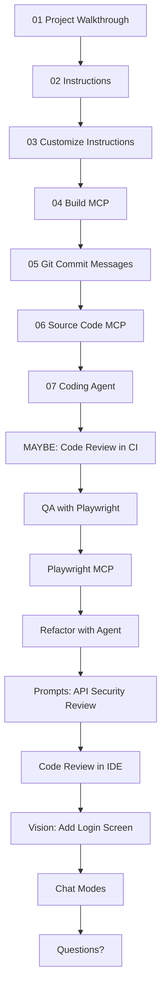

**What We"ll Cover:**

- [x] **01 Project Walkthrouhg**: Quick walkthrough of the project using Copilot + Running the FE/BE
- [x] **02 Instructions**: Generate copilot instructions for this project - using Copilot
- [x] **03 Cusomize Instructions**: Customize instructions with project structure, file desc + guidelines (CR, tests)
- [x] **04 Build MCP**: Create a Superheroes MCP to better understand the Superhero data schema
- [x] **05 Git Commit Messages**: Copilot can create git commit messages for us
- [x] **06 Source Code MCP**: Create and list issues in GitHub using MCP (issue: update mcp code documentation)
- [x] **07 Coding Agent**: assign issue directly from VS Code to Coding Agent to work in the background
- [x] **08 QA Playwright Tests**: Generate frontend Playwrite tests (as TDD)
- [x] **09 Playwright MCP + Chat Mode**: use Playwrite MCP to find more edge cases
- [ ] **Refactor with Agent**: move comparison logic to backend (TDD), keep FE as-is, run tests
- [x] **Prompts**: use task-specific prompt to review the APIs for Security issues
- [ ] **Code Review in IDE**: review selection + review uncommited changes
- [ ] **Vision to add Login Screen**: Using a screenshot for Design-to-Code
- [ ] **Chat Modes**: Review several modes: Plan, Debug, 4.1-Beast
- [ ] **MAYBE: Code Review in CI**: Look at the Code Review in the CI it automatically did
- [ ] **Questions?**

**Tips & Features:**
- [x] Starting new sessions every time
- [x] Having Agent run commands in terminal to close feedback loop
- [ ] Multiple copilot sessions
- [ ] Choosing the right models: https://docs.github.com/en/copilot/reference/ai-models/model-comparison
- [ ] Optimizing prompts for GPT-5: https://cdn.openai.com/API/docs/gpt-5-for-coding-cheatsheet.pdf
- [x] Task lists
- [ ] Restore checkpoint
- [ ] MAYBE: Repomix?
