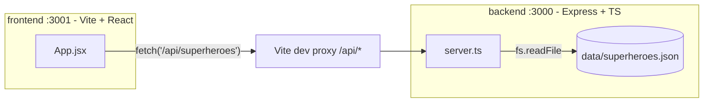

# AGENTS.md

Monorepo workshop app: Express/TypeScript backend serving a superheroes API, React (Vite) frontend rendering it in a table.

## Architecture

- Backend (`backend/src/server.ts`) is Express 5, ESM, run via `tsx`. Only `GET /` and `GET /api/superheroes` are implemented; a comment in the file describes additional planned endpoints (`/api/superheroes/:id`, `/api/superheroes/:id/powerstats`) that are exercise placeholders — implement these when asked to extend the API.
- Frontend (`frontend/src/App.jsx`) fetches `/api/superheroes` and renders a table; in dev, Vite proxies `/api/*` to `http://localhost:3000` so there's no CORS setup.
- Hero images referenced as `/assets/{image}` come from `frontend/public/assets/`.

## Build & Test

Run all commands from the repo root (npm workspaces: `backend`, `frontend`).

| Command | Purpose |
|---|---|
| `npm run test:backend` | Jest + Supertest unit/integration tests for the backend |
| `npm run test:e2e` | Playwright e2e tests (frontend); auto-starts both backend and frontend dev servers |
| `npm run test:all` | backend tests then e2e |
| `npm run build` | Builds the frontend (Vite, output to `frontend/build/`) |

Backend tests require `NODE_OPTIONS=--experimental-vm-modules` (already set in `backend/package.json`'s `test` script) because Jest runs in ESM mode via `ts-jest/presets/default-esm`.

## Conventions

- Both packages use `"type": "module"` — no CommonJS `require`.
- Backend is TypeScript with `strict: true`; frontend app code is plain JSX (no TS).
- New backend endpoints should follow the existing pattern in `server.ts`: async handler reading `data/superheroes.json` via `loadSuperheroes()`, 500 on read errors.
